# SnapSchool

<p align="center">
  
</p>

**SnapSchool turns a due date into a realistic daily learning plan—and adapts that plan as the student makes progress.**

Teachers, parents, and students can add assignments from descriptions, screenshots, photos, or documents. SnapSchool uses AI to identify the work, estimate the effort, and distribute it across the available days. Students then submit visible work or a written progress update; the plan is recalculated around what remains instead of becoming another static to-do list.

The product borrows the familiarity of social-media streaks while redirecting that behavior toward consistent academic progress.

> **Prototype status:** SnapSchool is a hackathon prototype, not a production student-information system. Do not use it with real student records until the privacy, security, accessibility, and school-policy work described below is complete.

## Product walkthrough

1. A teacher, parent, or student adds an assignment using a description and up to 10 supporting images or documents.
2. The AI extracts the deliverables and due date, estimates total effort, and proposes manageable daily missions.
3. The user reviews and can correct the title, due date, or source interpretation before publishing.
4. SnapSchool coordinates the student's assignments to reduce peak daily workload and completes planned work before the due date.
5. The student submits up to 10 progress photos, one document, or a written update such as “I read Chapter 1.”
6. AI describes the visible or self-reported progress, estimates what remains, and rebuilds the remaining plan.
7. Teachers see class progress and explicit student questions. Approved parents see the same current plan and progress that the student sees.

## Account experiences

| Role | Experience |
| --- | --- |
| **Student** | Urgency-ranked assignments, class color coding, daily workload estimate, assignment calendar, AI-generated missions, progress uploads, assignment questions, group-project collaboration, and personal assignment/class creation. |
| **Administrator / teacher** | Class and roster management, one assignment published to one or several classes, individual or multi-group work, AI source analysis, class-level progress, student evidence, extension dates, and a concise inbox containing student questions or explicit group requests. |
| **Parent** | Student-approved supervision connections, one calendar for all connected students or an individual child, an exact view of each student's latest plan and progress, personal assignment/class creation, and configurable progress emails. |

All roles use a unique username for connections and a separate, editable display name for the friendly name shown throughout the interface.

## Screenshots

### Three connected experiences

| Student dashboard | Teacher dashboard | Parent dashboard |
| :---: | :---: | :---: |
| 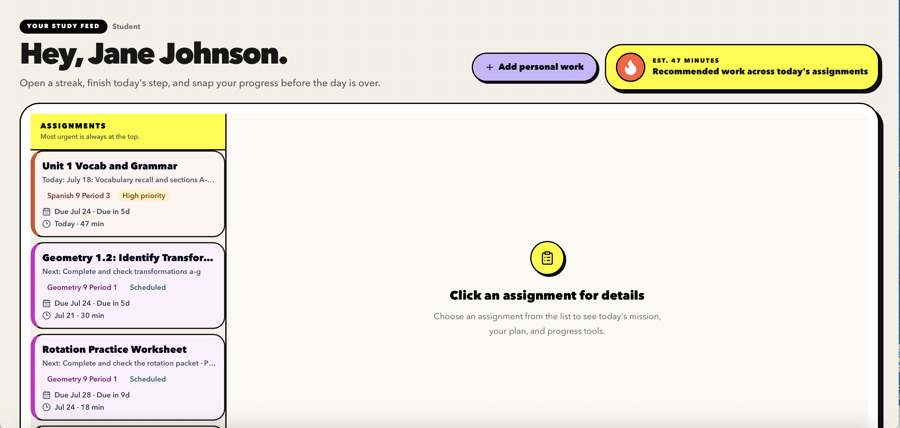 | 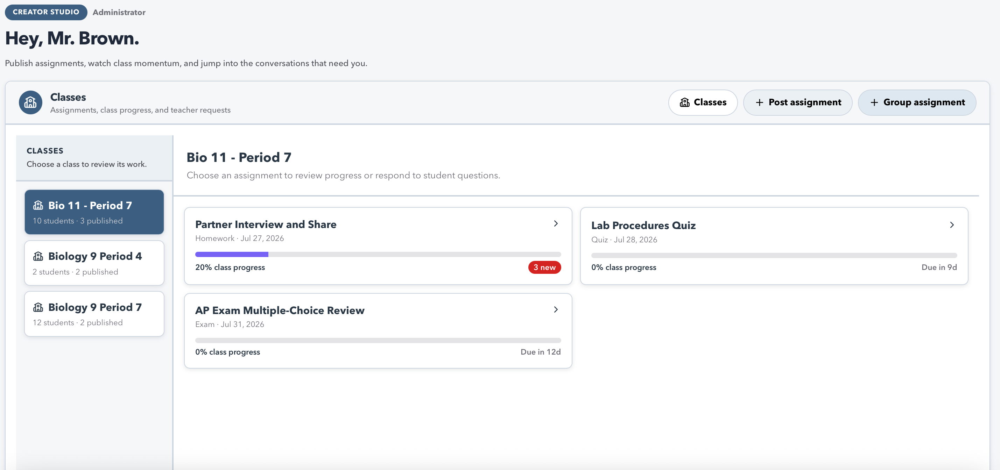 | 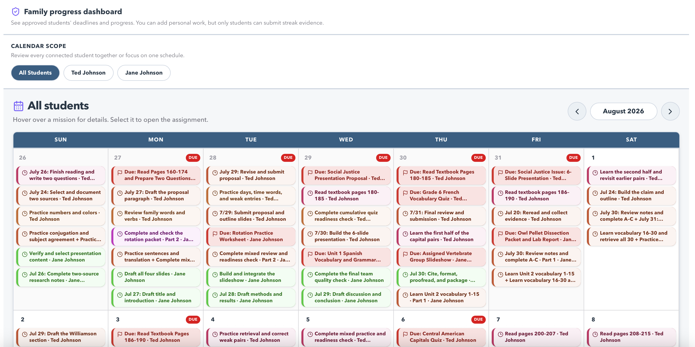 |
| Urgency-ranked work and today's total minutes | Classes, published work, progress, and questions | One combined calendar or an individual child's schedule |

### From source material to a balanced plan

| Upload assignment sources | AI review and teacher clarification |
| :---: | :---: |
| 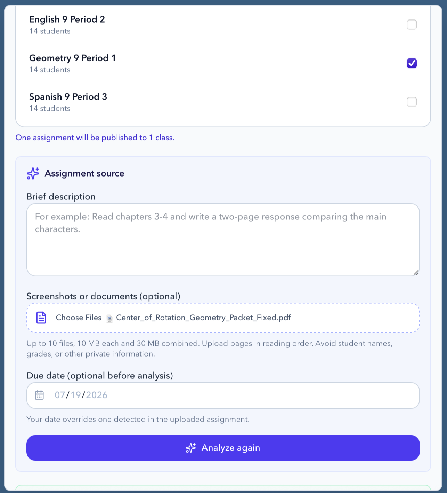 | 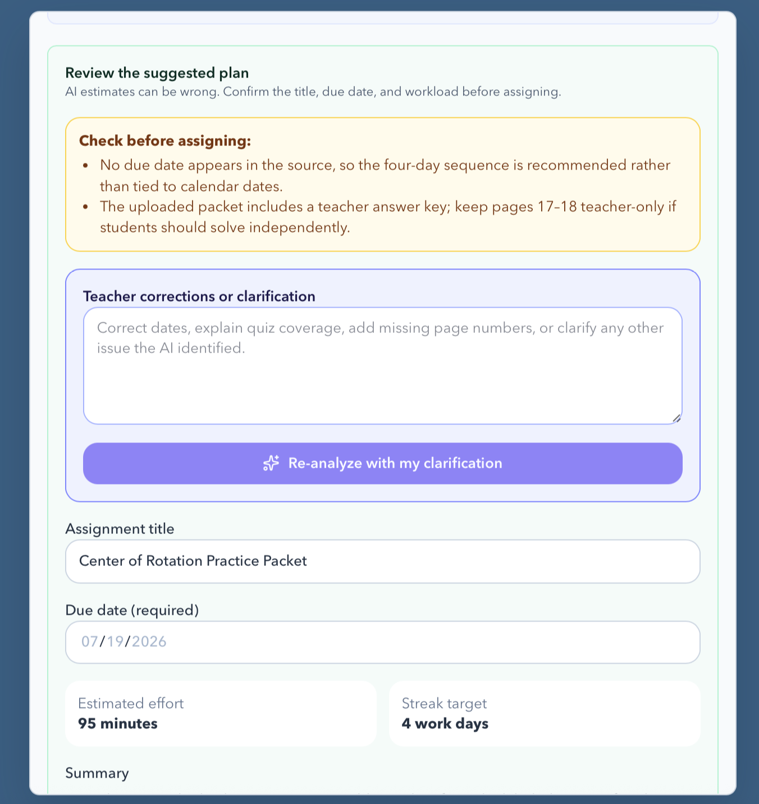 |
| A teacher can publish to multiple classes and provide up to 10 source files. | AI surfaces ambiguity before publication; this review-state example requires the creator to correct the deadline before assigning. |

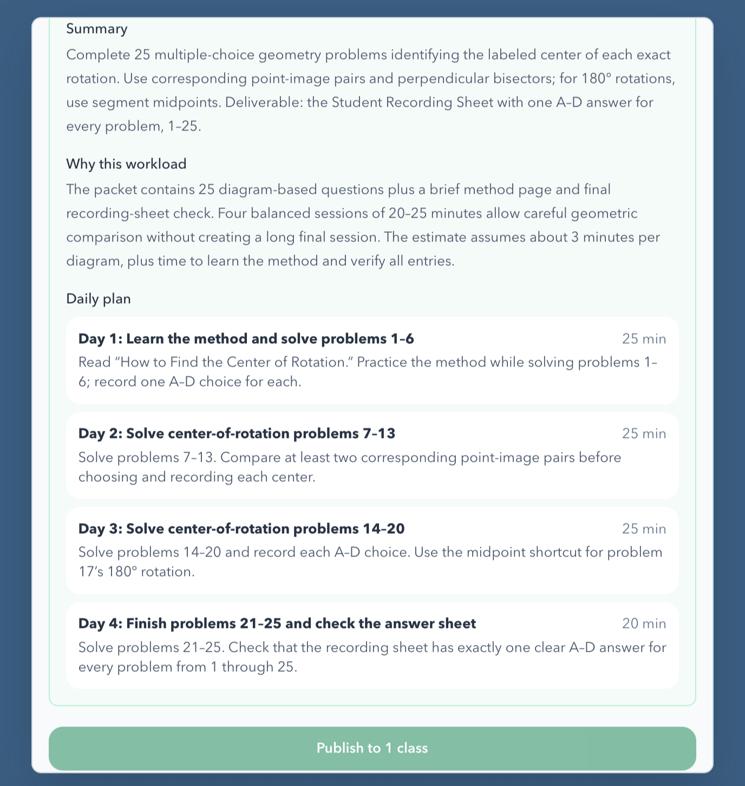

The final plan explains its estimate, produces concrete student-ready missions, and remains subject to teacher approval.

### Student planning and evidence

| Assignment mission and roadmap | Progress submission |
| :---: | :---: |
| 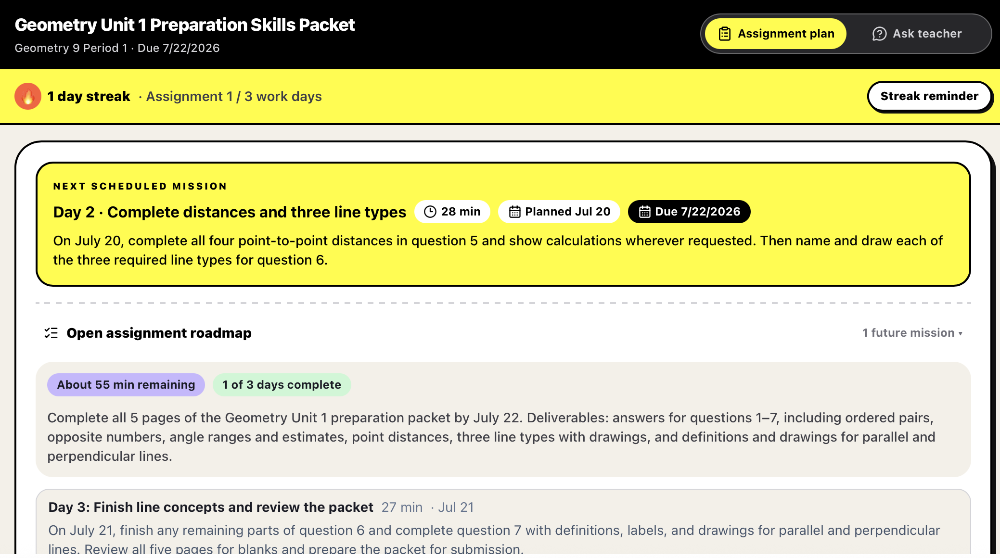 | 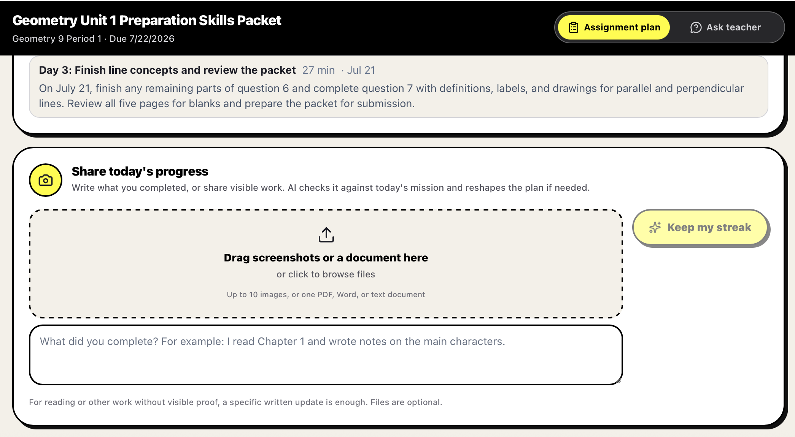 |

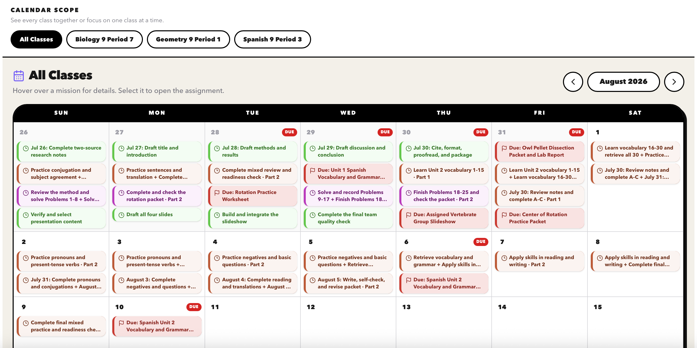

### Teacher oversight without notification overload

| Assignment-level progress | Question and teacher-request inbox |
| :---: | :---: |
| 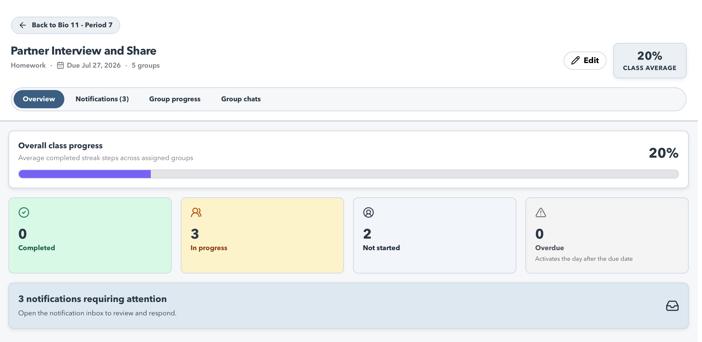 | 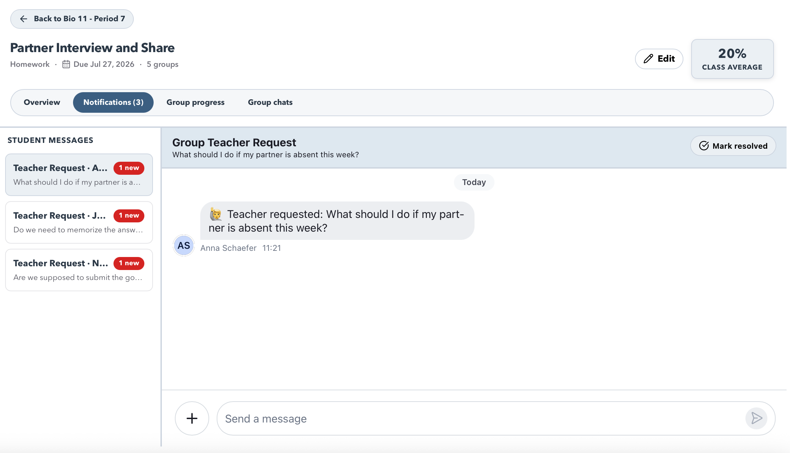 |

Only direct student questions and explicit group teacher requests require attention; ordinary group conversation and routine progress evidence do not become teacher alerts.

### Mobile student experience

<p align="center">
  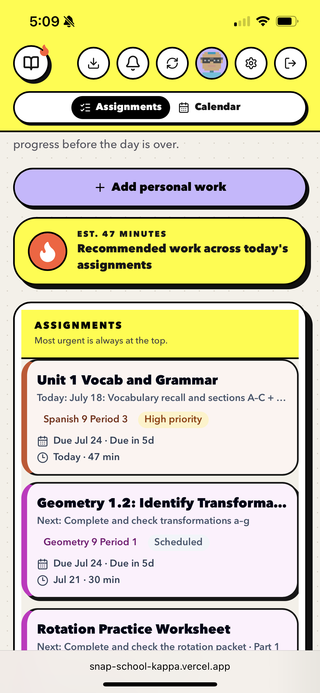
  &nbsp;&nbsp;
  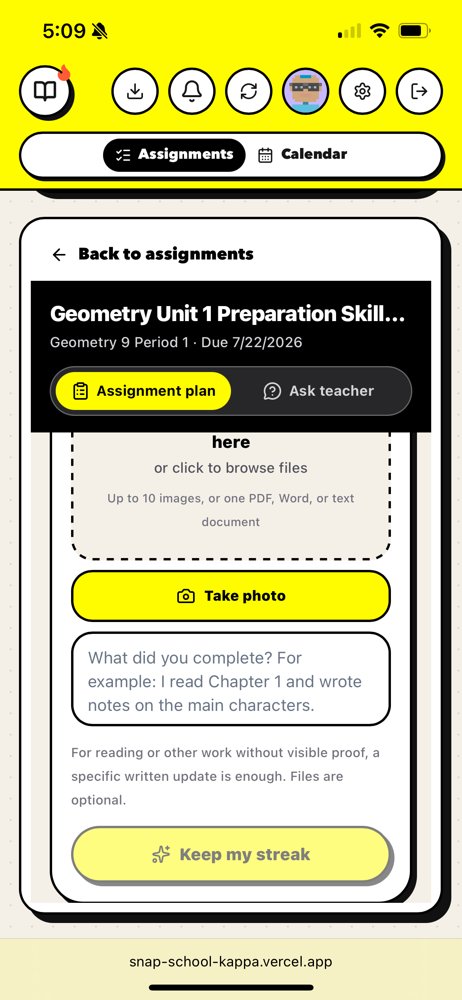
</p>

The responsive interface makes it practical to photograph work from a phone while preserving the same assignment plan shared with teachers and approved parents.

## Demo

- **Live application:** [https://snap-school-kappa.vercel.app](https://snap-school-kappa.vercel.app)
- **Suggested demo path:** teacher publishes an assignment → student receives a balanced plan → student submits progress → AI recalibrates the plan → teacher and parent see the update.

### Demo credentials

The repository does not contain passwords. Replace the placeholders below with dedicated, non-personal hackathon accounts immediately before submission, or provide the same credentials in Devpost's private judging instructions.

| Role | Email | Prepared state |
| --- | --- | --- | --- |
| Student | `<snapschooldemo.student@gmail.com>` | Member of the demo class with active assignments |
| Teacher | `<snapschooldemo.teacher@gmail.com>` | Owns the demo class and assignments |
| Parent | `<eva.moughan@gmail.com>` | Already approved by the demo student |

Use synthetic names and homework in these accounts. Never publish credentials for personal accounts or accounts containing real student information.

## Architecture

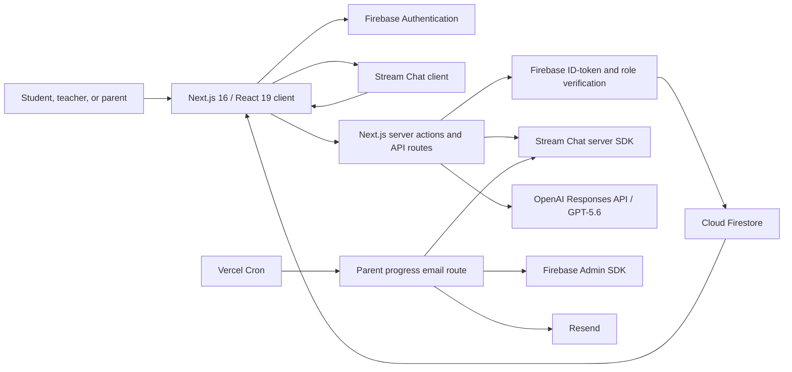

### Responsibilities by service

| Service | Responsibility |
| --- | --- |
| **Next.js / React / TypeScript** | Responsive student, teacher, and parent interfaces; server actions; protected API routes. |
| **Firebase Authentication** | Email/password sign-in and account identity. |
| **Cloud Firestore** | Profiles, roles, usernames, classes, rosters, parent approvals, streak metadata, and email preferences. |
| **Stream Chat** | Assignment channels, individual questions, group collaboration, assignment metadata, and progress messages. |
| **OpenAI Responses API** | Multimodal assignment interpretation, due-date suggestions, effort estimates, study plans, evidence review, and plan recalibration. |
| **Resend + Vercel Cron** | Parent-configurable due, urgent-workload, or daily summary emails. |

Privileged actions verify the Firebase ID token on the server before using Stream secrets, Firebase Admin credentials, or other server-only integrations. Browser code never receives those secrets.

## How Codex contributed

Codex was used as an iterative engineering collaborator throughout the project—not as a one-time code generator. Its contributions included:

- Translating product requirements into the three-role data model and user flows.
- Building and revising Next.js components, server actions, API routes, and Firestore rules.
- Integrating Firebase, Stream Chat, OpenAI, Resend, and Vercel Cron.
- Designing strict structured-output schemas for assignment and progress analysis.
- Debugging authentication, permissions, stale Stream data, rate limits, file uploads, responsive layouts, and deployment problems.
- Implementing deterministic workload balancing around the AI recommendations so the product does not rely on prompting alone.
- Running lint and TypeScript checks and iterating from hands-on testing across student, teacher, parent, desktop, and mobile experiences.

The product direction, educational use case, feature priorities, visual decisions, and acceptance testing were directed by the project creator. Codex helped implement and refine those decisions. At runtime, SnapSchool uses GPT-5.6 through the OpenAI Responses API; Codex is the development collaborator rather than the model presented as the in-product planner.

## Privacy and safety

SnapSchool handles potentially sensitive education-related content. The current prototype includes the following safeguards:

- **Authenticated access:** Firebase Authentication establishes the signed-in identity.
- **Server-side verification:** privileged actions verify Firebase ID tokens and enforce role, membership, ownership, class-roster, or approved-parent checks.
- **Firestore rules:** profiles, roles, parent connections, class rosters, and notification preferences have collection-specific access rules.
- **Explicit parent approval:** a parent cannot view a student's dashboard until the student approves the supervision request.
- **Ownership controls:** assignment and class deletion is restricted to the account that created the resource.
- **Server-only secrets:** OpenAI, Stream, Firebase Admin, Resend, and cron credentials are never exposed with `NEXT_PUBLIC_` variables.
- **Bounded uploads:** assignment analysis accepts at most 10 supported files, 10 MB each and 30 MB total. Progress review accepts one supported document or up to 10 photos, 10 MB each, with stricter combined-transfer limits in the client and API.
- **Reduced AI retention:** OpenAI requests set `store: false` and use a one-way hashed safety identifier instead of sending a username as that identifier.
- **Confidence gating:** low-confidence progress analysis does not complete a streak day. The student receives feedback explaining what is unclear or how to resubmit.
- **No automatic grading:** progress analysis looks for evidence of work toward the mission; it is explicitly instructed not to judge whether answers are correct.
- **Human correction:** assignment creators confirm or change titles and due dates and can provide clarification when the source is ambiguous.
- **Focused teacher notifications:** ordinary student progress updates and group conversation do not become teacher alerts. Direct student questions and explicit “Request Teacher” actions do.

### AI-use boundaries

AI output is a planning recommendation, not a grade, diagnosis, disciplinary decision, or authoritative statement about a student's ability. Image analysis can miss handwriting, cropped pages, repeated pages, or work outside the frame. Time estimates vary by student. Teachers, parents, and students should review recommendations and correct incorrect source interpretation.

For real-world deployment, the interface should clearly disclose when AI is being used, why an upload is processed, what services receive it, how long it is retained, and how a user can delete it or appeal an incorrect interpretation.

### Required work before real student use

- Complete FERPA, COPPA, school-policy, vendor-contract, and parental-consent review with qualified counsel and participating schools.
- Publish a privacy policy, terms of use, acceptable-use policy, retention schedule, subprocessors list, and account/data deletion procedure.
- Decide whether uploaded evidence should be retained at all; implement explicit retention periods and verified deletion across Firebase, Stream, OpenAI, logs, and backups.
- Add administrator audit logs, abuse reporting, moderation escalation, and incident-response procedures.
- Conduct a dedicated security assessment of Firestore rules, server actions, Stream permissions, file handling, and notification endpoints.
- Complete accessibility testing, including keyboard navigation, screen readers, focus management, color contrast, motion preferences, and mobile zoom.
- Use synthetic demo data only. Do not upload grades, student IDs, accommodation records, medical details, or unrelated faces/private information.

## Known limitations

- This is a hackathon prototype and has limited automated test coverage; important flows have primarily been checked with linting, TypeScript, builds, and manual role-based testing.
- It depends on configured Firebase, Stream, OpenAI, and optionally Resend services. A missing key, provider outage, quota, or rate limit can disable part of the experience.
- AI can misread images or documents, estimate time poorly, or produce an inappropriate plan. Deterministic balancing reduces uneven schedules but cannot know an individual student's actual working speed.
- SnapSchool does not currently integrate with a district SIS, LMS, gradebook, or school single sign-on provider.
- The responsive web application supports phone photography but is not a native iOS or Android application.
- Email delivery requires a verified Resend sender. Sandbox restrictions may limit recipients, and the current `11:00 UTC` cron corresponds to 7:00 a.m. Eastern only during daylight-saving time.
- Production-scale Stream query volume, large classes, concurrent updates, and long-term data growth require additional load testing and monitoring.
- The prototype should not be treated as evidence that an assignment was completed or submitted to a school.

## Technology

- Next.js 16, React 19, TypeScript, and Tailwind CSS
- Firebase Authentication, Cloud Firestore, and Firebase Admin
- Stream Chat and Stream Chat React
- OpenAI Responses API with GPT-5.6
- Resend, Vercel, date-fns, lucide-react, and shadcn/ui

## Local setup

1. Install dependencies:

   ```bash
   npm install
   ```

2. Copy the environment template:

   ```bash
   cp .env.example .env.local
   ```

3. Fill in `.env.local` with credentials from your Firebase, Stream, and OpenAI projects. Parent progress emails additionally require Firebase Admin, Resend, and `CRON_SECRET` values. Never commit this file.

4. Enable Email/Password authentication and Cloud Firestore in Firebase. Review and deploy the included `firestore.rules` to the intended Firebase project.

5. Start the development server:

   ```bash
   npm run dev
   ```

6. Open [http://localhost:3000](http://localhost:3000).

## Environment variables

The required names are documented in `.env.example`. Variables beginning with `NEXT_PUBLIC_` are included in browser code. OpenAI, Stream, Firebase Admin, Resend, and cron secrets must remain server-only.

| Area | Variables |
| --- | --- |
| Firebase web | `NEXT_PUBLIC_FIREBASE_API_KEY`, `NEXT_PUBLIC_FIREBASE_AUTH_DOMAIN`, `NEXT_PUBLIC_FIREBASE_PROJECT_ID`, `NEXT_PUBLIC_FIREBASE_STORAGE_BUCKET`, `NEXT_PUBLIC_FIREBASE_MESSAGING_SENDER_ID`, `NEXT_PUBLIC_FIREBASE_APP_ID` |
| Firebase Admin | `FIREBASE_CLIENT_EMAIL`, `FIREBASE_PRIVATE_KEY` |
| Stream | `NEXT_PUBLIC_STREAM_API_KEY`, `STREAM_SECRET_KEY` |
| OpenAI | `OPENAI_API_KEY` |
| Parent email | `RESEND_API_KEY`, `SNAPSCHOOL_EMAIL_FROM`, `CRON_SECRET`, `NEXT_PUBLIC_APP_URL` |
| Optional avatars | `NEXT_PUBLIC_IMAGE_URL` |

## Parent progress email setup

1. Deploy `firestore.rules` to the Firebase project.
2. Add a Firebase service-account client email and private key to Vercel as `FIREBASE_CLIENT_EMAIL` and `FIREBASE_PRIVATE_KEY`.
3. Verify a sender domain with Resend and set `RESEND_API_KEY` plus `SNAPSCHOOL_EMAIL_FROM`.
4. Add a random `CRON_SECRET` of at least 16 characters and set `NEXT_PUBLIC_APP_URL` to the production `/chat` URL.
5. Redeploy so Vercel registers the schedule from `vercel.json`.

Never prefix server credentials with `NEXT_PUBLIC_`, commit `.env.local`, or paste real keys into issues, screenshots, or demo documentation.

## Verification

```bash
npm run lint
npx tsc --noEmit
npm run build
```

## License

No open-source license has been selected yet. Until a license is added, the source remains copyrighted by its owner and is not automatically licensed for reuse, modification, or redistribution.
